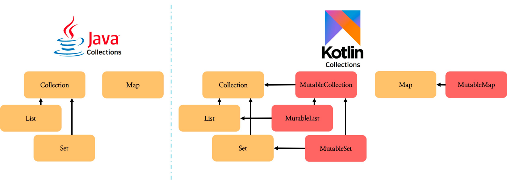

# Item 01. 가변성을 제한하라 

## 아이템 배경 이해
가변성이 있는 코드는 상태를 가지고 있게 된다. 
가변성이 있는 코드는 다음의 단점을 가지게 된다. 

1. 프로그램을 이해하고 디버그하기가 어렵다. 
2. 코드의 실행을 추론하기가 어렵다. 
3. **멀티스레드 환경에서는 적절한 동기화가 필요하다.** (아마도 가장 많이 겪은 불편함!)
4. 테스트가 어렵다. 
5. 상태 변경에 대한 notify가 필요한 경우도 있다. 

따라서 코틀린에서는 immutable 객체의 생성을 선호한다. 이를 위해 다음의 것들을 제공한다. 
- 읽기 전용 프로퍼티 (val)
- 가변 컬렉션과 읽기 전용 컬렉션 구분하기
- 데이터 클래스의 copy

## 가변성을 제어하는 방법
### 읽기 전용 프로퍼티 (val)

~~~kotlin 
val a = 10
a = 20 // error
~~~

변경을 시도하려 했으므로 에러가 발생한다. 다만 모든경우에서 변경이 불가능한 것은 아니다. 
읽기 전용 프로퍼티가 mutable 객체를 담고 있다면, 내부적으로 변할 수 있다:.
~~~kotlin 
val list = mutableListOf(1,2,3)
list.add(4)
print(list) // [1,2,3,4]
~~~

읽기 전용 프로퍼티는 다른 프로퍼티를 활용하는 사용자 정의 게터로도 정의할 수 있다. 
~~~kotlin 
var name: String = "hj"
var surname: String = "kim"
val fullName = get() = "$name $surname"

fun main() {
    println(fullName) // hj kim
    name = "dr"
    println(fullName) // hj dr
~~~

get()을 사용하면 프로퍼티의 값이 변경 가능. 
즉 읽기 전용 프로퍼티 val의 값은 변경될 수 있기는 하지만, 
프로퍼티 레퍼런스 자체를 변경할 수는 없으므로 동기화 문제 등을 줄일수 있다. 

* val은 final과 다르다. 읽기 전용이라는 뜻이지 변경이 불가능하다는 뜻은 아니다.

~~~kotlin
val name : String? =  "Marton"
val surname: String =  "Braun"

val fullName : String? 
    get() = name?.let {"$it $surname"}

val fullName2 : String? = name?.let {"$it $surname"}
~~~

### 읽기 전용 컬렉션
코틀린에서는 읽기 전용 컬렉션을 제공한다. 읽기 전용 컬렉션이란, (책에서 말하는 현재 기준) 컬렉션 자체가 읽기전용이 아닌, 
mutable이지만 add 등의 변경관련 메소드를 제공하지 않는 것이다. 이런 인터페이스 분리를 통해 안정성을 얻을 수 있다.  

만약 list를 mutable로 변경하고 싶다면 다음과 같이 작성해야한다. 
~~~kotlin
val list = listOf(1,2,3)

// don't
(list as MutableList).add(4)

// do 
val mutableList = list.toMutableList()
mutableList.add(4)
~~~

### copy
immutable 객체의 장점
- 한번 정의된 상태가 유지되므로 코드를 이해하기가 쉽다. 
- immutable 객체는 공유시에도 따로 충돌이 일어나지 않으므로 병렬처리가 안전하다
- 객체에 대한 참조가 변경되지 않으므로 캐싱에 문제가 없다
- defensive copy가 필요없다 (defensive copy : 객체를 반환할 때 객체 자체를 반환하는 것이 아니라 객체의 copy본을 반환하는 것)
- deep copy가 필요없다 
- imuutable 객체는 set/map의 key로 사용이 가능하다 (hash 값이 같기 때문)
- 다른 객체를 만들때 활용하기가 좋다 (변경점이 적기 때문)

mutable은 변경하기가 쉽지만 위험하고 immutable은 안전하지만 변경하기가 어렵다. 
따라서 일반적으로 immutable을 사용하며 변경이 필요할 시에는 새로운 객체를 만드는 방법을 쓴다. 
다만 새로운 객체를 만드는 방법이 어려우므로 data class 에서는 copy라는 메소드를 제공한다. 

~~~kotlin
data class User (
    val name : String, 
    val surname : String,
)

val user = User("hj", "kim")
val copiedUser = user.copy(name = "test")
println(copiedUser)  // name = test, surname = kim 
~~~

## 다른 종류의 변경 지점
~~~kotlin
val list1: MutableList<Int> = mutableListOf()
var list2: List<Int> = listOf()

list1.add(1)
list2 = list2 + 1
~~~
list1의 경우 변경가능한 list이므로 add 연산을 했을때 list에 원소가 더해지게 된다. 멀티스레드에서 처리가 이루어질경우 동기화 이슈가 발생할 수 있다
두번째의 경우 프로퍼티가 변경가능하다. 비교적 멀티스레드에서의 처리 안정성이 좋다. 

### 변경 가능 지점 노출하지 말기 
변경이 가능한 객체를 노출한다면, 의도치 않게 해당 객체가 변경될 수 있다. 
이를 막기 위해 
- 방어적 복제(defensive copy)를 사용한다 : 리턴하는 객체를 copy하여 return 한다 
- 가변성을 제한한다 : 업캐스팅 

## 정리
- var보다는 val을 사용하는 것이 좋다
- mutable 프로퍼티보다는 immutable 프로퍼티를 사용하는 것이 좋다
- mutable 객체와 클래스보다는 immutable 객체와 클래스를 사용하는 것이 좋다
- 변경이 필요한 대상을 만들어야한다면 immutable 데이터 클래스로 만들고 copy를 활용하는 것이 좋다
- 컬렉션에 상태를 저장해야한다면, mutable 컬렉션보다는 읽기 전용 컬렉션을 사용하는 것이 좋다
- 변이 지점을 적절히 설계하고 불필요한 변이지점은 만들지 않은 것이 좋다
- mutable 객체를 외부에 노출하지 않는 것이 좋다. 

* 단, 최적화 이슈로 mutable을 사용하는 것이 좋을 때도 있다 (3부 효율성)
* immutable 객체를 사용할때는 언제나 멀티쓰레드 때에 더 많은 신경을 써야한다. 

## 과제 
총체적 난국 테스트가 잘 돌아갈 수 있도록 수정해주세요! 
총체적 난국 테스트를 해결하기 위한 방법은 여러가지가 있습니다. 다양한 방법으로 과제를 해보고
다음 시간에 같이 이야기 나눠요!
